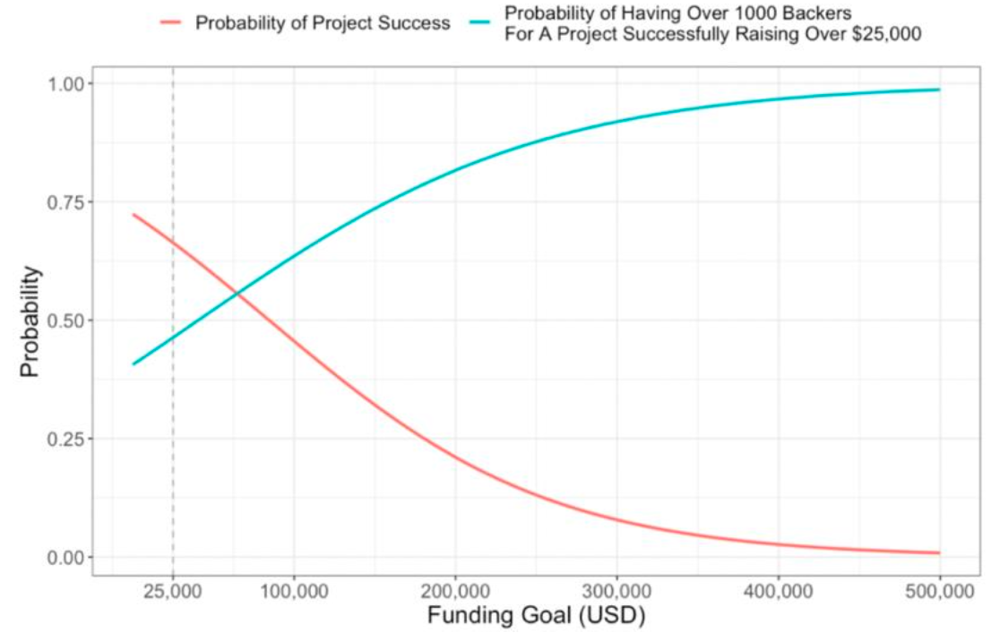

## Data Analysis Projects

### 1. Housing Price Prediction and Fraud Detection

Detecting housing fraud is an important component of monitoring housing markets. Detecting all housing fraud cases manually would be difficult, it’s a great choice to make use of data modeling and prediction tools to help with detection.

This project constructs a model to predict the expected cost of houses in TWD at the time of scale with detailed methods and steps, tests the accuracy of the model and explains how different factors can influence housing price based on the model. Our analyses conclude that a generalized additive model with splines can fit the housing data well. The influences of transaction date, house age, distance to nearest MRT station, and longitude and latitude on the housing price are wiggly. The influence of number of stores within living circle on foot on the housing price is roughly linear. A integrated function that predicts house prices is provided, and examples and documentation are provided after the main body of the report.

<a href="https://github.com/mengtzhou/data-analysis-projects/blob/main/housing-price-prediction-fraud-detection.pdf">See Report</a>

### 2. Buying a Laptop from eBay

Figure out the relationship between price and laptop specifics (processor speed, RAM space, hard drive space and type), selling status (sold or not) and selling strategy (auction or buy it now), and give suggestions on good deals, based on 220 records of laptop price data scraped from eBay. Particularly, to meet the customer’s requirement and expectations, this projects explains whether and how the hard drive type (solid state or not) and selling strategy (auction or buy it now) affect the price in detail, analyzes the prices of unsold buy-it-now laptops with a large hard drive and proposes the best price.

It is found that the prices of laptops that are buy-it-now, still not sold and have a solid-state hard drive and higher speed of processor are higher. The best price for an unsold laptop with a large hard drive is around \$410.

<a href="https://github.com/mengtzhou/data-analysis-projects/blob/main/buying-a-laptop-from-eBay.pdf">See Report</a>

### 3. Impact of Eye Laser Treatment

Diabetic retinopathy is a diabetes complication that affects eyes, which is caused by damage to the blood vessels of the light-sensitive tissue at the retina or back of the eye. It can lead to blindness if not treated in time. Ophthalmologists at Michigan Medicine conducted a medical study to explore the impact of two eye laser treatments (xenon and argon) on delaying vision loss caused by diabetic retinopathy. This projects aims to analyze the data of 197 participants of this medical study, who presented high-risk diabetic retinopathy, to determine the efficacy of treatment type on visual acuity, quantify the improvement between eyes by treatment type, and better understand the impacts of age at diagnosis and clinical risk of diabetic retinopathy on visual acuity. We performed survival analysis and modeled the probability of vision loss for the censored data, and we concluded that laser treatment can help delay vision loss caused by diabetic retinopathy and risk of diabetic retinopathy has an impact on visual acuity.

<a href="https://github.com/mengtzhou/data-analysis-projects/blob/main/Impact-of-Eye-Laser-Treatment.pdf">See Report</a>

### 4. Factors Associated with Kickstarter Success

Kickstarter is a global crowdfunding platform focused on creativity and it could be a good way to generate start-up funds and advertise your business prior to opening. While many projects are funded successfully, more projects fail generally. It’s a smart choice for creators to understand factors associated with Kickstarter success before investing time in a Kickstarter campaign.

This project explores what generally makes for a successful campaign using past Kickstarter campaign data and then predicts the chance of success for a new community-based business aiming to raise at least \$25,000 from at least 1000 backers in Detroit. Our analyses conclude that the funding goal, the length of project name, the month and weekday of the deadline, the year, month and weekday of creating date, and the time span from launching the campaign to deadline have impacts on the Kickstarter success. The chance of success of the new community-based business is predicted as 0.665.

<a href="https://github.com/mengtzhou/data-analysis-projects/blob/main/factors-associated-with-Kickstarter-success.pdf">See Report</a>

### 5. Drug Use Classification by Personality Traits and Demographic Characteristics

Drug use/misuse has become common in the twenty-first century, and identifying factors that increases an individual’s risk of drug consumption has become ever important. In this project, we aim to apply four classification models to UCI Machine Learning Repository’s Drug Consumption data set. Using logistic regression, k-nearest neighbors (KNN), support vector machines (SVM), and random forests, we seek to highlight the similarities and differences between these four models. Our findings indicate that different models will find similar variables more important and personality traits play an important role in classifying drug users. Nevertheless, all models found it easier to correctly classify those with heavy drug use (defined as using more than 5 different drugs in their lifetime) than those with less drug use. This perhaps implies that heavy drug users are characteristics that are more similar, making them easier to classify. Finally, we find that our logistic regression and KNN models have lower errors than our SVM and random forest models. This gives credence to Occam’s Razor which states that at times simpler models are better.

<a href="https://github.com/mengtzhou/data-analysis-projects/blob/main/drug-use-clarification.pdf">See Report</a>

### 6. Stock Daily Return for Top 10 US Companies by Market Capitalization

In this project, we obtained the 20 Years of End-of-Day Stock Data for Top 10 US Companies by Market Capitalization, called stock data in short, from Amazon Web Service (AWS) data product, and US Market Information Factor Data, called factor data in short, from 202009 CRSP database, and explored these two sets of data using dplyr, data.table tools and Bootstrap/permutation test method in R.

We solved three questions: 

+ Explore whether there exists a linear relationship between the trading volume increase and stock price increase by calculating the correlation coefficient and its confidence interval between these two variables.
+ Observe the trend for mean daily return for these 10 stocks over years, in other words, whether the mean daily return for each year is steady or fluctuate dramatically; 
+ Examine whether the risks for these 10 stocks are the same based on CAPM model and find out whether the market return, size premiumand value premium are significant for the return of stock, in other words, how well the three factor model works based on Fama and French Three Factor Model.

<a href="https://github.com/mengtzhou/data-analysis-projects/blob/main/stock-daily-return.pdf">See Report</a>

### 7. Life Expectancy Explanation with Health and Economical Factors

This work is conducted based on the survey data of 183 countries from the Global Health Observa- tory (GHO) data repository under World Health Organization (WHO) to explore the relationship between life expectancy and some health and economical factors. Based on the best weight least square model we fitted, it can be concluded that developed countries with less alcohol consumption, longer schooling years, lower under-five deaths and higher GDP tend to larger life expectancy. Keep the other factors the same, there is a 2.59-year decrease of life expectancy for developing countries compared with developed countries; 1 litres increase of alcohol consumption per capita (15+) would lead to 0.39-year decrease of life expectancy; 1-year increase of schooling would leads to a 1.92-year increase of life expectancy; if the number of under five deaths increases to 10-fold, there would be a 1.95-year decrease of life expectancy; if the GDP increases to 10-fold, there would be a 1.43-year decrease of life expectancy. Furthermore, the effects of these significant factors (except status) are the same among developing and developed countries.

<a href="https://github.com/mengtzhou/data-analysis-projects/blob/main/life-expectancy-explanation.pdf">See Report</a>

